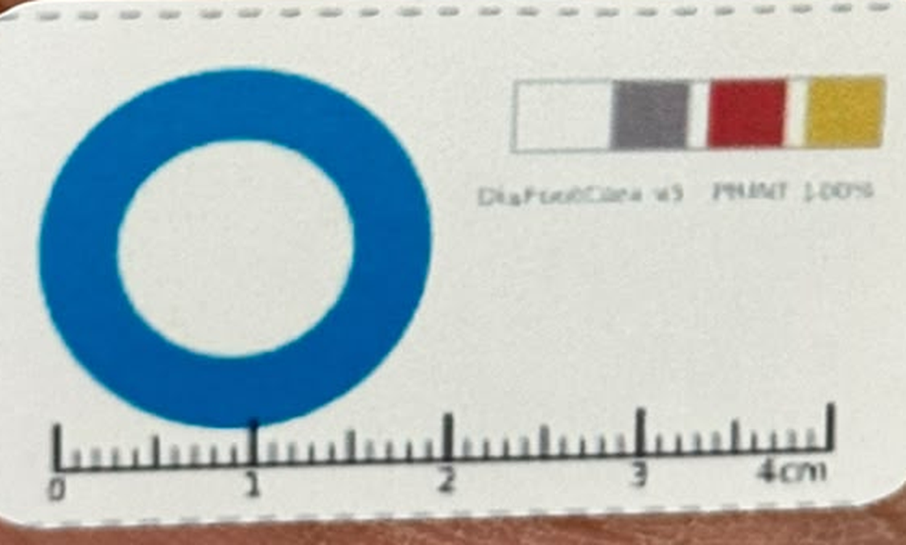

# How DiaFootCare turns a photograph into centimetres

**Repository:** `github.com/Ibraheemshehada/diafootcare_new`
**Last updated:** 2026-08-29 · app `1.2.2+6`

Every formula here is taken from the shipped code, not from a design note. The
file and line are given so each one can be checked against what actually runs:

| Step | Source |
|---|---|
| Ring detection and scale | `lib/features/wound/analysis/services/ring_detector.dart` |
| Wound extents and area | `lib/features/wound/analysis/services/ai_service.dart` |
| Infection triage | `lib/features/wound/analysis/services/infection_triage.dart` |
| Glucose units | `lib/features/glucose/glucose_unit.dart` |
| Server-side equivalents | `daifootcare-web/inference/ring.py`, `pipeline.py` |

---

## 1. The problem this solves

A photograph has no scale. The same ulcer is 400 pixels across from 20 cm away
and 200 pixels from 40 cm, and nothing in the image says which. Before
calibration the app assumed the wider side of the frame spanned a fixed
`_assumedFrameCm = 12.0`:

$$\text{px/cm} = \frac{\max(W_{px}, H_{px})}{12.0}$$

That is still the fallback when no reference is visible, and it is the whole of
a measured failure: a real patient's 1.4 cm wound was reported as **0.9 cm**,
because the assumption was wrong by exactly the ratio of the true distance to
the assumed one. Any measurement produced this way is marked *not calibrated* on
screen and in the record.

The fix is to put an object of known size in the photograph.

---

## 2. The calibration label

*The label as printed and used, photographed beside a patient's wound. The cyan
annulus is the reference: outer diameter **2.0 cm**. The compact variant uses a
**1.5 cm magenta** annulus. Printed at 100% scale — the note on the card exists
because a printer set to "fit to page" silently rescales it and every
measurement taken with it is wrong by that factor.*

### 2.0 Why this shape, and what it cost to learn

The label went through the design in this order, and each element is there
because of something that failed without it.

**An annulus, not a disc.** The single decisive test in detection is whether the
mark has a hole (§2.3). A filled circle cannot be told apart from a bottle cap,
a coin, a shadow or a fold of blue surgical drape — and the drape is not
hypothetical: an early version locked onto one in the background and reported an
1102 px "ring", which put the whole foot at about 2 cm wide. A ring is a shape
almost nothing in a clinical photograph accidentally imitates.

**A circle, not a square or a marker.** Under perspective a circle projects to an
ellipse whose major axis is unforeshortened, so the scale survives tilt and the
tilt itself is recoverable from the same two numbers (§3). A square gives neither
for free. ArUco and QR markers were considered and dropped: they need a clean,
flat, well-lit print to decode at all, and they give a yes/no answer — this
gives a graded one that degrades honestly.

**Two sizes.** The 2.0 cm cyan ring is the standard. The 1.5 cm magenta variant
exists for small wounds and cramped sites, where a 2 cm mark cannot be placed
close enough without touching the wound bed. **The colour is the size key** — the
detector infers `ringCm` from which hue band matched, so reading the hue wrong
scales every measurement by 4/3. That is why the two hue bands are far apart
(cyan 80–115, magenta 145–175) and not adjacent shades.

**A ruler along the bottom.** Not used by the software at all. It is there so a
clinician can check the app against a printed scale in the same photograph, and
so a photograph remains measurable by hand if the detector fails.

**Colour patches** (white, grey, red, yellow). Reserved for white-balance and
colour normalisation, which the tissue model may need later. Not used by the
current pipeline. They are also why the *white* patch matters to §5 — the whole
card is on white stock, and that turned out to be the thing that separates
printed ink from tissue.

**The 2.0 cm figure itself** is a compromise: large enough that at typical
phone distance the ring spans 150–250 px in a 1200 px photograph (so a
one-pixel error in the extent is ~0.5% of the scale), and small enough to sit
beside a wound on a toe without covering anything.

### 2.1 Finding it

Work is done on the frame downscaled to 640 px wide, then scaled back. Pixels
are selected in HSV:

| Ring | Hue | Saturation | Value |
|---|---|---|---|
| Cyan (2.0 cm) | 80–115 | ≥ 60 | ≥ 40 |
| Magenta (1.5 cm) | 145–175 | ≥ 110 | ≥ 50 |

Hue is on OpenCV's 0–179 scale, saturation and value on 0–255. The mask is
opened (erode 3, dilate 3) then closed (dilate 2, erode 2), and
connected components are extracted. Each component is then put through four
tests, and this is where the design earns its keep.

### 2.2 Orientation and extents, per component

For a component with $n$ pixels and centroid $(\bar{x}, \bar{y})$, the second
central moments are

$$\sigma_{xx} = \tfrac{1}{n}\sum (x_i-\bar{x})^2, \qquad
\sigma_{yy} = \tfrac{1}{n}\sum (y_i-\bar{y})^2, \qquad
\sigma_{xy} = \tfrac{1}{n}\sum (x_i-\bar{x})(y_i-\bar{y})$$

The principal axis is at

$$\theta = \tfrac{1}{2}\arctan\!\left(\frac{2\sigma_{xy}}{\sigma_{xx}-\sigma_{yy}}\right)$$

Every pixel is projected onto that axis and its perpendicular,

$$u_i = \Delta x_i\cos\theta + \Delta y_i\sin\theta, \qquad
v_i = -\Delta x_i\sin\theta + \Delta y_i\cos\theta$$

and the extents are the ranges, ordered so the major axis is the longer:

$$a = \max u - \min u, \qquad b = \max v - \min v$$
$$\text{major} = \max(a,b), \qquad \text{minor} = \min(a,b)$$

This is the projection extent along the principal axes — the same quantity
OpenCV's `minAreaRect` reports, computed directly.

### 2.3 The four tests

**Roundness.** A circle projects to an ellipse under perspective, never to a
sliver:

$$r = \frac{\text{minor}}{\text{major}} \ge 0.5$$

**Frame share.** A ring photographed to be measured occupies a sane part of the
frame:

$$0.02 < \frac{\text{major}}{\max(W,H)} < 0.45$$

**The hole.** The decisive one. The mark is an *annulus*; a surgical drape, a
sleeve or a shadow is solid. A disc of radius $\max(2, 0.15\,\text{minor})$ at
the centroid is sampled, and the component is rejected if more than **23.5%** of
it is still ink. Without this test the detector locked onto a blue drape in the
background and reported an 1102 px "ring" — a foot apparently photographed 2 cm
wide.

**Fill ratio.** An annulus covers part of its own ellipse; a disc covers all of
it:

$$0.12 < \frac{n}{\pi \cdot \frac{\text{major}}{2} \cdot \frac{\text{minor}}{2}} < 0.95$$

### 2.4 Choosing between survivors

$$\text{score} = r \cdot \min\!\left(1, \frac{n}{600}\right)$$

Ranked by roundness, **not by size**. Picking the largest surviving blob favours
skin regions that pass the filters by luck; the calibration mark is the roundest
thing in frame with a clean hole. The area term only suppresses specks.

---

## 3. Scale, and why tilt does not corrupt it

$$\boxed{\ \text{px/cm} = \frac{\text{major}_{px}}{d_{cm}}\ }
\qquad d_{cm} = 2.0 \ \text{(cyan)} \ \text{or}\ 1.5 \ \text{(magenta)}$$

This is a **pure ratio**. It needs no focal length, no sensor size, no camera
intrinsics and no calibration of the phone — which is what makes it work across
every device in a study without per-device setup.

The major axis is used deliberately. Under perspective a circle of diameter $d$
tilted by $\phi$ projects to an ellipse whose **minor** axis is foreshortened by
$\cos\phi$ while its **major** axis is not:

$$\text{major} = s\,d, \qquad \text{minor} = s\,d\cos\phi$$

So the scale survives tilt, and the tilt itself falls out of the same two
numbers:

$$\boxed{\ \phi = \arccos\!\left(\frac{\text{minor}}{\text{major}}\right)\ }$$

reported in degrees. Nothing extra is measured to obtain it.

### 3.1 What tilt costs, measured

From the clinical batches (§ FINDINGS):

| Tilt band | Mean measurement error | n |
|---|---|---|
| ≤ 30° | **18.1%** | — |
| 30–40° | **39.6%** | — |
| > 40° | **55.8%** | — |

Correlation between tilt and error: **r = +0.479**.

Those three rows are the entire justification for the capture guard: the camera
shows $\phi$ live and **refuses the photograph above 40°**, warns between 30°
and 40°, and is quiet below 30°. The thresholds in the live camera and in the
post-capture check are the same numbers, deliberately — a preview that allows
what the next screen rejects is worse than no preview.

---

## 4. The wound

### 4.1 Segmentation

Model 1 (U-Net, MobileNetV2 encoder with scSE attention, 384×384) produces a
probability map. Post-processing, in order:

1. **2-view TTA** — the horizontal flip is predicted too and the two maps
   averaged.
2. **Threshold** at 0.5. If nothing survives, fall back to $0.5 \times \max p$,
   so a faint but real wound is not lost.
3. **Morphology** — 5×5 open, then 5×5 close.
4. **Printed-label removal** — see §5.
5. **Largest connected component only.** One wound per photograph.

### 4.2 From mask pixels to centimetres

The mask is computed at model resolution and measured in original-image pixels,
with anisotropic scaling so a non-square photograph measures correctly:

$$s_x = \frac{W_{orig}}{w_{mask}}, \qquad s_y = \frac{H_{orig}}{h_{mask}}$$

Length and width use the **same PCA extent** as §2.2, applied to the wound mask:

$$\boxed{\ L = \frac{\text{major}_{px}}{\text{px/cm}}, \qquad
W = \frac{\text{minor}_{px}}{\text{px/cm}}\ }$$

This replaced an axis-aligned bounding box, which over-measures any wound lying
diagonally in the frame.

Area is the **true segmented pixel count**, not $L \times W$ and not an ellipse
estimate:

$$\boxed{\ A_{cm^2} = \frac{n_{mask}\; s_x s_y}{(\text{px/cm})^2}\ }$$

Area is the more sensitive healing signal of the three, because it responds to
change in every direction at once rather than along one chosen axis.

### 4.3 Healing progress

$$\text{progress} = \operatorname{clamp}_{0}^{100}\!\left(
\frac{A_{baseline} - A_{now}}{A_{baseline}} \times 100 \right)$$

### 4.4 A zero is not a measurement

The model returns 0 when it finds no wound. Sub-millimetre is the same thing —
no ulcer is 0.4 mm across — so the screen shows *no wound found* rather than
"0.00 cm" whenever $L \le 0.05$ cm or $W \le 0$. Since the label guard shipped
this happens on 6 of 157 clinic photographs, and "0.00 cm" reads as a healed
wound.

---

## 5. Teaching the model that the label is not a wound

The label solved the scale and created a new problem. Model 1 v1.1 had never
seen a printed calibration mark — nothing in FUSeg, DFUTissue or Medetec
contains one — and it segmented the **magenta 1.5 cm ring as wound tissue** on
**16 of 42** small-label photographs. On 6 of 157 clinic photographs the sticker
was the *only* thing it found.

The reason is not carelessness by the model. Vivid granulation tissue and
magenta printing occupy the **same hue band**, and to a network trained to find
"red-pink region inside a foot photograph" a magenta annulus is a textbook
positive. It is a training-data gap, not a bug.

### 5.1 The option that was rejected

The obvious fix is to change the label — print the ring in a colour no tissue
takes. That was considered and **declined by the clinical lead**: labels were
already printed and in use at two hospitals, and re-issuing them mid-study
breaks comparability between batches photographed before and after.

So the decision was to keep the label and fix it in two places that fail
independently: teach the model, and add a guard that does not use the model.

### 5.2 The training set, and how the outlines were made

31 distinct wounds across two hospitals, photographed with the label in frame.
Every wound was **outlined by hand** to a fixed rule — trace the wound bed
margin, exclude callus and intact skin, exclude the label — producing **61
scored outlines**.

Hand outlines were chosen over the model's own masks for a reason that was
measured, not assumed: on the same wounds, drawn boundaries reach **9.6–11.8%**
error against the clinicians' tape where the model reached **25.8%**, and — more
important for a training target — they repeat. Two photographs of one wound give
±5.8% between drawn outlines and ±15.0% between model masks. *A boundary drawn to
a fixed rule is not merely more accurate, it is more repeatable, which is what a
training target has to be.*

Outlines were screened before use: any outline more than 20% from the clinician's
measurement was flagged and redrawn. One at +25.9% was teaching the model to
over-measure, and was replaced.

### 5.3 The fine-tune

Starting from v1.1, encoder frozen, decoder and head trained on the clinical
outlines mixed with the original data so general performance is not traded away.

Two mistakes in this stage are worth recording, because both were silent:

- **The freeze did not happen.** The code guarded on `model.backbone`, which
  does not survive saving and loading — `hasattr` was quietly false, no layer
  was frozen, and the whole network trained at 3e-4. Fixed by freezing on layer
  name prefixes and asserting that trainable parameters fall below 80% of the
  total. MobileNetV2 loads flat here (149 of 188 layers), which is why the
  attribute route looked reasonable in the first place.
- **Two stages shared one checkpoint filename**, so stage 2's first epoch
  overwrote stage 1's best weights before they were ever evaluated.

### 5.4 Result

| | v1.1 | v1.2 |
|---|---|---|
| Label segmented as wound | **16 / 42** | **0 / 42** |
| Clinical held-out Dice | 0.803 | **0.869** |
| FUSeg val Dice | 0.854 | **0.861** |
| Mean error vs tape | 13.3% | **12.7%** |

FUSeg moving up rather than down is the part that matters as much as the
headline: the clinical gain did not come out of general performance.

### 5.5 The second defence, which does not use the model

A model can regress; a retrain can be reverted. So an independent guard runs
after segmentation, and it deliberately does **not** use colour — measured ink
fraction inside real granulation runs 0.37–0.60, overlapping the printed label,
so a colour test rejected real wounds. Colour was tried first and abandoned on
that evidence.

What separates them is that the printed label sits on **white card**. For each
candidate component a 4-pixel collar is taken around its bounding box and tested
for paper:

$$\text{paper}(p) = \left[S(p) < 50\right] \wedge \left[V(p) > 170\right]$$

$$\text{white surround} = \frac{|\{p \in \text{collar} : \text{paper}(p)\}|}{|\text{collar}|} > 0.40$$

A component whose surroundings are that white is printing, not tissue, and is
erased from the mask before measurement.

---

## 6. Infection triage

Model 3 gives $p$ = P(infection) from the wound crop. It is **banded**, not
thresholded, because every threshold sits on one ROC curve and at clinic
prevalence the deployed 0.41 cut-off has **PPV 0.45** — wrong more often than
right.

$$\text{zone}(p) = \begin{cases}
\text{low} & p < 0.30\\
\text{uncertain} & 0.30 \le p \le 0.80\\
\text{high} & p > 0.80
\end{cases}$$

Five IWGDF/IDSA signs a camera cannot capture are collected from the patient:
purulent discharge, warmth, swelling, tenderness, systemic upset. The rule, in
order of precedence:

| # | Condition | Outcome |
|---|---|---|
| 1 | systemic upset | **urgent** |
| 2 | purulent discharge | **see clinician** |
| 3 | $\mathbb{1}[\text{zone}=\text{high}] + \text{local signs} \ge 2$ | **see clinician** |
| 4 | zone = high, nothing reported | **recheck photo** |
| 5 | exactly 1 sign, or zone = uncertain | **monitor** |
| 6 | otherwise | **no signs** |

Rules 1 and 2 are IWGDF/IDSA definitions, not thresholds we chose. Rule 3 is the
two-sign bar for a local infection. An uncertain image deliberately contributes
**nothing** to the count: letting a coin-flip cast half a vote is how false
alarms return.

Measured on the reproduced cross-validation: **false alarms among healthy
patients 25.9% → 4.3%**.

"No signs" is never rendered as *normal*. A wound with no infection signs but
impaired perfusion shows the ischaemia warning instead, and a perfusion caveat
is shown under **every** blood-flow result including a reassuring one, because
this model reads colour and texture — it does not palpate a pulse, run a Doppler
or take an ankle pressure.

---

## 7. Glucose units

Stored canonically in mg/dL. The exact molar mass of glucose is 180.156 g/mol,
giving

$$\boxed{\ 1\ \text{mmol/L} = 18.0182\ \text{mg/dL}\ }$$

$$v_{mg/dL} = 18.0182\, v_{mmol/L}, \qquad
v_{mmol/L} = \frac{v_{mg/dL}}{18.0182}$$

Validation happens **in the unit the patient typed**, then converts — checking a
converted value against mg/dL bounds would reject an ordinary 6.2 mmol/L. The
plausible range is 20–600 mg/dL, converted into whichever unit is on screen.

Switching units converts what is already typed. Leaving the digits alone would
silently change their meaning: 110 entered as mg/dL becoming 110 mmol/L, which
is not a survivable blood sugar and would be stored as one.

---

## 8. Accuracy as measured, not as hoped

31 distinct wounds across two hospitals, against clinicians' tape measurements.

| | Mean error |
|---|---|
| Model 1, v1.1 (before the clinical fine-tune) | 13.3% |
| Model 1, v1.2 (shipped) | **12.7%** |
| Hand-drawn outlines of the same wounds | 9.6–11.8% |
| Repeatability, same wound photographed twice — model | ±15.0% |
| Repeatability — hand-drawn | ±5.8% |

Calibration itself is accurate to **±1.8–5%**; the residual error is
segmentation, not scale.

Held-out Dice: clinical 0.803 → **0.869**, FUSeg 0.854 → **0.861**, so the
clinical gain did not cost general performance.

**This is not a measuring instrument.** 12.7% mean error on a 3 cm wound is
about 4 mm, and the hand-drawn figure shows where the ceiling of this training
target lies. The numbers are useful as a **trend** for one wound photographed
the same way over time, and should not be read as a substitute for a ruler.

> A note on the gate: `gate_report.json` from the fine-tune records
> `"passed": false`. That flag is wrong — it averages before and after over
> *different sets of wounds*, and one wound that v1.1 could not measure at all
> entered the average as a large regression. Over the 11 wounds both versions
> measure, error went 13.32% → 12.69%. The bug is documented and unfixed; do not
> read the flag without reading § FINDINGS 18.

---

## 9. Where the same maths runs twice

The app measures on the phone; the server sidecar can measure the same
photograph when a clinic enables server mode. Both implement everything above —
`ring_detector.dart` and `inference/ring.py` are line-for-line ports of the same
validated script, and a parity test compares their output.

Verified on `teston app .jpeg`, a photograph in no training or validation set:

| | Phone | Server |
|---|---|---|
| Scale | 123.8 px/cm | 123.4 px/cm |
| Tilt | 25.0° | 24.5° |

A 0.3% disagreement on scale, from independent code paths in two languages.

---

## Related

- [FINDINGS](../../DF/clinical_validation/FINDINGS.md) — the running clinical record (kept outside this repository, with the patient data)
- [ACCURACY_IMPROVEMENT_PLAN](ACCURACY_IMPROVEMENT_PLAN.md) — the investigation that led here
- [MODEL1_RETRAINING](MODEL1_RETRAINING.md) — the fine-tune and its gate
- [DESIGN_MODIFICATION_LOG](DESIGN_MODIFICATION_LOG.md) — what changed, round by round
